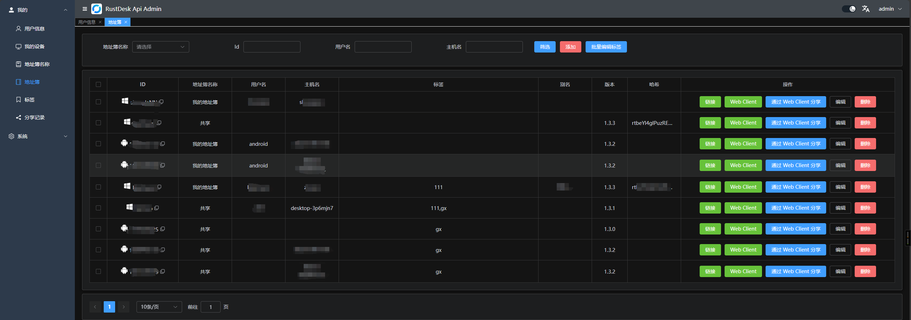
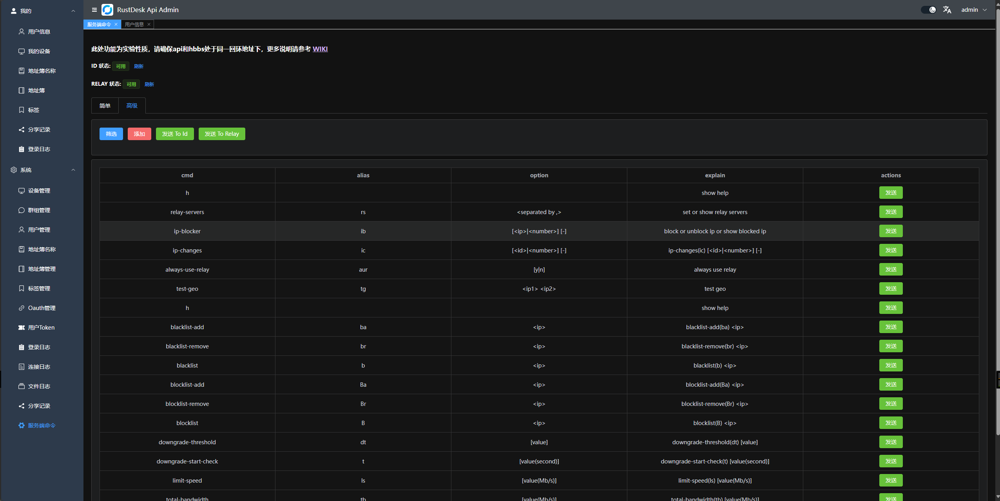

# RustDesk API

[English Doc](README_EN.md)

本项目使用 Go 实现了 RustDesk 的 API，并包含了 Web Admin 和 Web 客户端。RustDesk 是一个远程桌面软件，提供了自托管的解决方案。

 <div align=center>


</div>

# 特性

- PC端API
    - 个人版API
    - 登录
    - 地址簿
    - 群组
    - 授权登录，支持`github`, `google` 和 `OIDC` 登录，支持`web后台`授权登录
    - i18n
- Web Admin
    - 用户管理
    - 设备管理
    - 地址簿管理
    - 标签管理
    - 群组管理
    - Oauth 管理
    - 登录日志
    - 链接日志
    - 文件传输日志
    - 快速使用web client
    - i18n
    - 通过 web client 分享给游客
    - server控制(一些官方的简单的指令 [WIKI](https://github.com/lejianwen/rustdesk-api/wiki/Rustdesk-Command))
- Web Client
    - 自动获取API server
    - 自动获取ID服务器和KEY
    - 自动获取地址簿
    - 游客通过临时分享链接直接远程到设备
    - v2 Preview
- CLI
    - 重置管理员密码

## 功能

### API 服务 
基本实现了PC端基础的接口。支持Personal版本接口，可以通过配置文件`rustdesk.personal`或环境变量`RUSTDESK_API_RUSTDESK_PERSONAL`来控制是否启用

#### 登录

- 添加了`github`, `google` 以及`OIDC`授权登录，需要在后台配置好就可以用了，具体可看后台OAuth配置
- 添加了web后台授权登录,点击后直接登录后台就自动登录客户端了


#### 地址簿


#### 群组
群组分为`共享组`和`普通组`，共享组中所有人都能看到小组成员的设备，普通组只有管理员能看到所有小组成员的设备


### Web Admin:

* 使用前后端分离，提供用户友好的管理界面，主要用来管理和展示。前端代码在[rustdesk-api-web](https://github.com/lejianwen/rustdesk-api-web)

* 后台访问地址是`http://<your server>[:port]/_admin/`初次安装管理员为用户名密码为`admin` `admin`，请即时更改密码

1. 管理员界面
   
2. 普通用户界面
   
   右上角可以更改密码,可以切换语言，可以切换`白天/黑夜`模式

   

3. 每个用户可以多个地址簿，也可以将地址簿共享给其他用户
4. 分组可以自定义，方便管理，暂时支持两种类型: `共享组` 和 `普通组`
5. 可以直接打开webclient，方便使用；也可以分享给游客，游客可以直接通过webclient远程到设备
   
6. Oauth,支持了`Github`, `Google` 以及 `OIDC`, 需要创建一个`OAuth App`，然后配置到后台
   
    - 对于`Google` 和 `Github`, `Issuer` 和 `Scopes`不需要填写.
    - 对于`OIDC`, `Issuer`是必须的。`Scopes`是可选的，默认为 `openid,profile,email`. 确保可以获取 `sub`,`email` 和`preferred_username`
    - `github oauth app`在`Settings`->`Developer settings`->`OAuth Apps`->`New OAuth App`
      中创建,地址 [https://github.com/settings/developers](https://github.com/settings/developers)
    - `Authorization callback URL`填写`http://<your server[:port]>/api/oauth/callback`
      ，比如`http://127.0.0.1:21114/api/oauth/callback`
7. 登录日志
8. 链接日志
9. 文件传输日志
10. server控制

  - `简易模式`,已经界面化了一些简单的指令，可以直接在后台执行
    

  - `高级模式`,直接在后台执行指令
      * 可以官方指令
      * 可以添加自定义指令
      * 可以执行自定义指令
    
    
 

### Web Client:

1. 如果已经登录了后台，web client将自动直接登录
2. 如果没登录后台，点击右上角登录即可，api server已经自动配置好了
3. 登录后，会自动同步ID服务器和KEY
4. 登录后，会将地址簿自动保存到web client中，方便使用
5. 现已支持`v2 Preview`，访问路径是`/webclient2`
   
6. `v2 preview` 部署，参考[WIKI](https://github.com/lejianwen/rustdesk-api/wiki)


### 自动化文档: 使用 Swag 生成 API 文档，方便开发者理解和使用 API。

1. 后台文档 `<youer server[:port]>/admin/swagger/index.html`
2. PC端文档 `<youer server[:port]>/swagger/index.html`
   

### CLI
```bash
# 查看帮助
./apimain -h
```

#### 重置管理员密码
```bash
./apimain reset-admin-pwd <pwd>
```

## 安装与运行

### 相关配置

* 参考`conf/config.yaml`配置文件，修改相关配置。
* 如果`gorm.type`是`sqlite`，则不需要配置mysql相关配置。
* 语言如果不设置默认为`zh-CN`

```yaml
lang: "en"
app:
  web-client: 1  # 1:启用 0:禁用
  register: false #是否开启注册
  show-swagger: 0 #是否显示swagger文档
gin:
  api-addr: "0.0.0.0:21114"
  mode: "release"
  resources-path: 'resources'
  trust-proxy: ""
gorm:
  type: "sqlite"
  max-idle-conns: 10
  max-open-conns: 100
mysql:
  username: "root"
  password: "111111"
  addr: "192.168.1.66:3308"
  dbname: "rustdesk"
rustdesk:
  id-server: "192.168.1.66:21116"
  relay-server: "192.168.1.66:21117"
  api-server: "http://192.168.1.66:21114"
  key: "123456789"
  personal: 1
logger:
  path: "./runtime/log.txt"
  level: "warn" #trace,debug,info,warn,error,fatal
  report-caller: true
proxy:
  enable: false
  host: ""
jwt:
  key: ""
  expire-duration: 360000
```

### 环境变量
变量名前缀是`RUSTDESK_API`，环境变量如果存在将覆盖配置文件中的配置

| 变量名                                               | 说明                                                      | 示例                           |
|---------------------------------------------------|---------------------------------------------------------|------------------------------|
| TZ                                                | 时区                                                      | Asia/Shanghai                |
| RUSTDESK_API_LANG                                 | 语言                                                      | `en`,`zh-CN`                 |
| RUSTDESK_API_APP_WEB_CLIENT                       | 是否启用web-client; 1:启用,0:不启用; 默认启用                        | 1                            |
| RUSTDESK_API_APP_REGISTER                         | 是否开启注册; `true`, `false`  默认`false`                      | `false`                      |
| RUSTDESK_API_APP_SHOW_SWAGGER                     | 是否可见swagger文档;`1`显示，`0`不显示，默认`0`不显示                     | `1`                          |
| -----ADMIN配置-----                                 | ----------                                              | ----------                   |
| RUSTDESK_API_ADMIN_TITLE                          | 后台标题                                                    | `RustDesk Api Admin`         |
| RUSTDESK_API_ADMIN_HELLO                          | 后台欢迎语，可以使用`html`                                        |                              |
| RUSTDESK_API_ADMIN_HELLO_FILE                     | 后台欢迎语文件，如果内容多，使用文件更方便。<br>会覆盖`RUSTDESK_API_ADMIN_HELLO` | `./conf/admin/hello.html`    |
| -----GIN配置-----                                   | ----------                                              | ----------                   |
| RUSTDESK_API_GIN_TRUST_PROXY                      | 信任的代理IP列表，以`,`分割，默认信任所有                                 | 192.168.1.2,192.168.1.3      |
| -----------GORM配置----------------                 | ------------------------------------                    | ---------------------------  |
| RUSTDESK_API_GORM_TYPE                            | 数据库类型sqlite或者mysql，默认sqlite                             | sqlite                       |
| RUSTDESK_API_GORM_MAX_IDLE_CONNS                  | 数据库最大空闲连接数                                              | 10                           |
| RUSTDESK_API_GORM_MAX_OPEN_CONNS                  | 数据库最大打开连接数                                              | 100                          |
| RUSTDESK_API_RUSTDESK_PERSONAL                    | 是否启用个人版API， 1:启用,0:不启用； 默认启用                            | 1                            |
| -----MYSQL配置-----                                 | ----------                                              | ----------                   |
| RUSTDESK_API_MYSQL_USERNAME                       | mysql用户名                                                | root                         |
| RUSTDESK_API_MYSQL_PASSWORD                       | mysql密码                                                 | 111111                       |
| RUSTDESK_API_MYSQL_ADDR                           | mysql地址                                                 | 192.168.1.66:3306            |
| RUSTDESK_API_MYSQL_DBNAME                         | mysql数据库名                                               | rustdesk                     |
| -----RUSTDESK配置-----                              | ---------------                                         | ----------                   |
| RUSTDESK_API_RUSTDESK_ID_SERVER                   | Rustdesk的id服务器地址                                        | 192.168.1.66:21116           |
| RUSTDESK_API_RUSTDESK_RELAY_SERVER                | Rustdesk的relay服务器地址                                     | 192.168.1.66:21117           |
| RUSTDESK_API_RUSTDESK_API_SERVER                  | Rustdesk的api服务器地址                                       | http://192.168.1.66:21114    |
| RUSTDESK_API_RUSTDESK_KEY                         | Rustdesk的key                                            | 123456789                    |
| RUSTDESK_API_RUSTDESK_KEY_FILE                    | Rustdesk存放key的文件                                        | `./conf/data/id_ed25519.pub` |
| RUSTDESK_API_RUSTDESK_WEBCLIENT_MAGIC_QUERYONLINE | Web client v2 中是否启用新的在线状态查询方法; `1`:启用,`0`:不启用,默认不启用     | `0`                          |
| ----PROXY配置-----                                  | ---------------                                         | ----------                   |
| RUSTDESK_API_PROXY_ENABLE                         | 是否启用代理:`false`, `true`                                  | `false`                      |
| RUSTDESK_API_PROXY_HOST                           | 代理地址                                                    | `http://127.0.0.1:1080`      |
| ----JWT配置----                                     | --------                                                | --------                     |
| RUSTDESK_API_JWT_KEY                              | 自定义JWT KEY,为空则不启用JWT                                    |                              |
| RUSTDESK_API_JWT_EXPIRE_DURATION                  | JWT有效时间                                                 | 360000                       |


### 运行

#### docker运行

1. 直接docker运行,配置可以通过挂载配置文件`/app/conf/config.yaml`来修改,或者通过环境变量覆盖配置文件中的配置

    ```bash
    docker run -d --name rustdesk-api -p 21114:21114 \
    -v /data/rustdesk/api:/app/data \
    -e TZ=Asia/Shanghai \
    -e RUSTDESK_API_LANG=zh-CN \
    -e RUSTDESK_API_RUSTDESK_ID_SERVER=192.168.1.66:21116 \
    -e RUSTDESK_API_RUSTDESK_RELAY_SERVER=192.168.1.66:21117 \
    -e RUSTDESK_API_RUSTDESK_API_SERVER=http://192.168.1.66:21114 \
    -e RUSTDESK_API_RUSTDESK_KEY=<key> \
    lejianwen/rustdesk-api
    ```

2. 使用`docker compose`，参考[WIKI](https://github.com/lejianwen/rustdesk-api/wiki)

#### 下载release直接运行

[下载地址](https://github.com/lejianwen/rustdesk-api/releases)

#### 源码安装

1. 克隆仓库
   ```bash
   git clone https://github.com/lejianwen/rustdesk-api.git
   cd rustdesk-api
   ```

2. 安装依赖

    ```bash
    go mod tidy
    #安装swag，如果不需要生成文档，可以不安装
    go install github.com/swaggo/swag/cmd/swag@latest
    ```

3. 编译后台前端，前端代码在[rustdesk-api-web](https://github.com/lejianwen/rustdesk-api-web)中
   ```bash
   cd resources
   mkdir -p admin
   git clone https://github.com/lejianwen/rustdesk-api-web
   cd rustdesk-api-web
   npm install
   npm run build
   cp -ar dist/* ../admin/
   ```
4. 运行
    ```bash
    #直接运行
    go run cmd/apimain.go
    #或者使用generate_api.go生成api并运行
    go generate generate_api.go
    ```
5. 编译，如果想自己编译,先cd到项目根目录，然后windows下直接运行`build.bat`,linux下运行`build.sh`,编译后会在`release`
   目录下生成对应的可执行文件。直接运行编译后的可执行文件即可。

6. 打开浏览器访问`http://<your server[:port]>/_admin/`，默认用户名密码为`admin`，请及时更改密码。


#### 使用我fork后的server-s6镜像运行

- github https://github.com/lejianwen/rustdesk-server
- docker hub https://hub.docker.com/r/lejianwen/rustdesk-server-s6

```yaml
 networks:
   rustdesk-net:
     external: false
 services:
   rustdesk:
     ports:
       - 21114:21114
       - 21115:21115
       - 21116:21116
       - 21116:21116/udp
       - 21117:21117
       - 21118:21118
       - 21119:21119
     image: lejianwen/rustdesk-server-s6:latest
     environment:
       - RELAY=<relay_server[:port]>
       - ENCRYPTED_ONLY=1
       - MUST_LOGIN=N
       - TZ=Asia/Shanghai
       - RUSTDESK_API_RUSTDESK_ID_SERVER=<id_server[:21116]>
       - RUSTDESK_API_RUSTDESK_RELAY_SERVER=<relay_server[:21117]>
       - RUSTDESK_API_RUSTDESK_API_SERVER=http://<api_server[:21114]>
       - RUSTDESK_API_KEY_FILE=/data/id_ed25519.pub
       - RUSTDESK_API_JWT_KEY=xxxxxx # jwt key
     volumes:
       - /data/rustdesk/server:/data
       - /data/rustdesk/api:/app/data #将数据库挂载
     networks:
       - rustdesk-net
     restart: unless-stopped
       
```


## 其他

- [WIKI](https://github.com/lejianwen/rustdesk-api/wiki)
- [链接超时问题](https://github.com/lejianwen/rustdesk-api/issues/92)
- [修改客户端ID](https://github.com/abdullah-erturk/RustDesk-ID-Changer)
- [webclient来源](https://hub.docker.com/r/keyurbhole/flutter_web_desk)