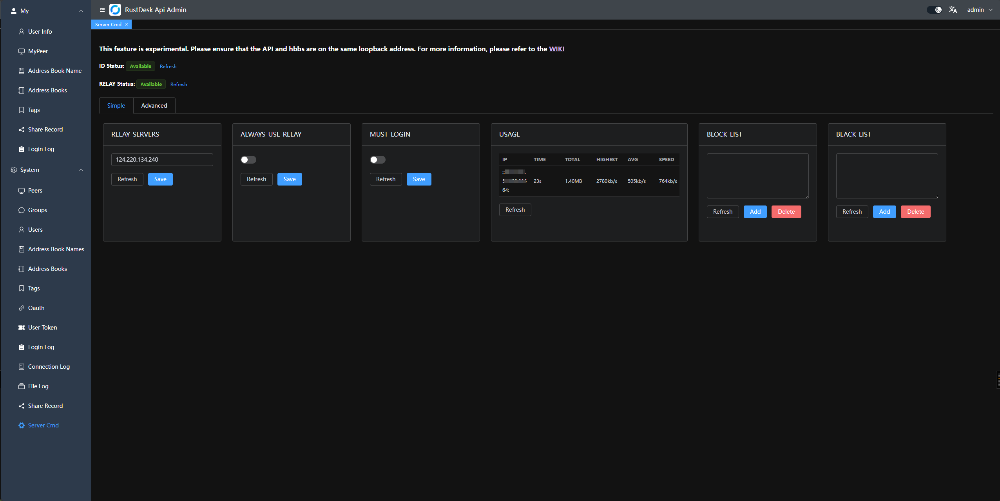
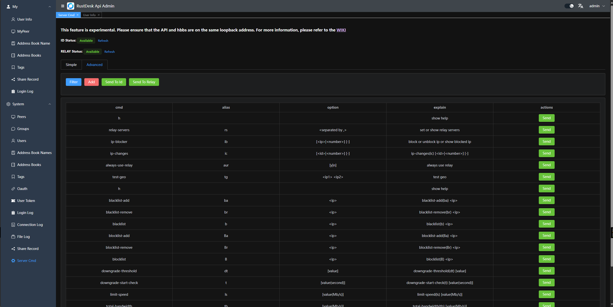

# RustDesk API

This project implements the RustDesk API using Go, and includes both a web UI and web client. RustDesk is a remote
desktop software that provides self-hosted solutions.

<div align=center>


</div>

# Features

- PC API
    - Personal API
    - Login
    - Address Book
    - Groups
    - Authorized login, supports `GitHub`, `Google` and `OIDC` login, supports `web admin` authorized login
    - i18n
- Web Admin
    - User Management
    - Device Management
    - Address Book Management
    - Tag Management
    - Group Management
    - OAuth Management
    - Login Logs
    - Connection Logs
    - File Transfer Logs
    - Quick access to web client
    - i18n
    - Share to guest by web client
    - Server control (some simple official commands [WIKI](https://github.com/lejianwen/rustdesk-api/wiki/Rustdesk-Command))
- Web Client
    - Automatically obtain API server
    - Automatically obtain ID server and KEY
    - Automatically obtain address book
    - Visitors are remotely to the device via a temporary sharing link
- CLI
    - Reset admin password

## Overview

### API Service
Basic implementation of the PC client's primary interfaces.Supports the Personal version api, which can be enabled by configuring the `rustdesk.personal` file or the `RUSTDESK_API_RUSTDESK_PERSONAL` environment variable.

<table>
    <tr>
      <td width="50%" align="center" colspan="2"><b>Login</b></td>
    </tr>
    <tr>
        <td width="50%" align="center" colspan="2"></td>
    </tr>
     <tr>
      <td width="50%" align="center"><b>Address Book</b></td>
      <td width="50%" align="center"><b>Groups</b></td>
    </tr>
    <tr>
        <td width="50%" align="center"></td>
        <td width="50%" align="center"></td>
    </tr>
</table>

### Web Admin

* The frontend and backend are separated to provide a user-friendly management interface, primarily for managing and
displaying data.Frontend code is available at [rustdesk-api-web](https://github.com/lejianwen/rustdesk-api-web)

* Admin panel URL: `http://<your server[:port]>/_admin/`
* For the initial installation, the admin username is `admin`, and the password will be printed in the console. You can change the password via the [command line](#CLI).

  


1. Admin interface:
   
2. Regular user interface:
   

3. Each user can have multiple address books, which can also be shared with other users.
4. Groups can be customized for easy management. Currently, two types are supported: `shared group` and `regular group`.
5. You can directly launch the client or open the web client for convenience; you can also share it with guests, who can remotely access the device via the web client.
6. OAuth support: Currently, `GitHub`, `Google` and `OIDC`  are supported. You need to create an `OAuth App` and configure it in
   the admin panel.
    - For `Google` and `Github`, you don't need to fill the `Issuer` and `Scpoes`
    - For `OIDC`, you must set the `Issuer`. And `Scopes` is optional which default is `openid,email,profile`, please make sure this `Oauth App` can access `sub`, `email` and `preferred_username`
    - Create a `GitHub OAuth App`
      at `Settings` -> `Developer settings` -> `OAuth Apps` -> `New OAuth App` [here](https://github.com/settings/developers).
    - Set the `Authorization callback URL` to `http://<your server[:port]>/api/oauth/callback`,
      e.g., `http://127.0.0.1:21114/api/oauth/callback`.
   
7. Login logs
8. Connection logs
9. File transfer logs
10. Server control
  - `Simple mode`, some simple commands have been GUI-ized and can be executed directly in the backend
    

  - `Advanced mode`, commands can be executed directly in the backend
    * Official commands can be used
    * Custom commands can be added
    * Custom commands can be executed

    


### Web Client:

1. If you're already logged into the admin panel, the web client will log in automatically.
2. If you're not logged in, simply click the login button in the top right corner, and the API server will be
   pre-configured.
3. After logging in, the ID server and key will be automatically synced.
4. The address book will also be automatically saved to the web client for convenient use.
5. Now supports `v2 Preview`, accessible at `/webclient2`
   
6. `v2 preview` deployment, [WIKI](https://github.com/lejianwen/rustdesk-api/wiki)

### Automated Documentation : API documentation is generated using Swag, making it easier for developers to understand and use the API.

1. Admin panel docs: `<your server[:port]>/admin/swagger/index.html`
2. PC client docs: `<your server[:port]>/swagger/index.html`
   

### CLI
```bash
# help
./apimain -h
```

#### Reset admin password
```bash
./apimain reset-admin-pwd <pwd>
```

## Installation and Setup

### Configuration

* Modify the configuration in `conf/config.yaml`. 
* If `gorm.type` is set to `sqlite`, MySQL-related configurations are not required.
* Language support: `en` and `zh-CN` are supported. The default is `zh-CN`.

```yaml
lang: "en"
app:
  web-client: 1  # web client route 1:open 0:close  
  register: false #register enable
  show-swagger: 0 #show swagger 1:open 0:close
gin:
  api-addr: "0.0.0.0:21114"
  mode: "release"
  resources-path: 'resources'
  trust-proxy: ""
gorm:
  type: "sqlite"
  max-idle-conns: 10
  max-open-conns: 100
mysql:
  username: "root"
  password: "111111"
  addr: "192.168.1.66:3308"
  dbname: "rustdesk"
rustdesk:
  id-server: "192.168.1.66:21116"
  relay-server: "192.168.1.66:21117"
  api-server: "http://192.168.1.66:21114"
  key: "123456789"
  personal: 1
logger:
  path: "./runtime/log.txt"
  level: "warn" #trace,debug,info,warn,error,fatal
  report-caller: true
proxy:
  enable: false
  host: ""
jwt:
  key: ""
  expire-duration: 360000
```

### Environment Variables
The prefix for variable names is `RUSTDESK_API`. If environment variables exist, they will override the configurations in the configuration file.

| Variable Name                                     | Description                                                                                                  | Example                       |
|---------------------------------------------------|--------------------------------------------------------------------------------------------------------------|-------------------------------|
| TZ                                                | timezone                                                                                                     | Asia/Shanghai                 |
| RUSTDESK_API_LANG                                 | Language                                                                                                     | `en`,`zh-CN`                  |
| RUSTDESK_API_APP_WEB_CLIENT                       | web client on/off; 1: on, 0 off, default: 1                                                                  | 1                             |
| RUSTDESK_API_APP_REGISTER                         | register enable; `true`, `false`; default:`false`                                                            | `false`                       |
| RUSTDESK_API_APP_SHOW_SWAGGER                     | swagger visible; 1: yes, 0: no; default: 0                                                                   | `0`                           |
| RUSTDESK_API_APP_TOKEN_EXPIRE                     | token expire duration(second)                                                                                | `3600`                        |
| ----- ADMIN Configuration-----                    | ----------                                                                                                   | ----------                    |
| RUSTDESK_API_ADMIN_TITLE                          | Admin Title                                                                                                  | `RustDesk Api Admin`          |
| RUSTDESK_API_ADMIN_HELLO                          | Admin welcome message, you can use `html`                                                                    |                               |
| RUSTDESK_API_ADMIN_HELLO_FILE                     | Admin welcome message file,<br>will override `RUSTDESK_API_ADMIN_HELLO`                                      | `./conf/admin/hello.html`     |
| ----- GIN Configuration -----                     | ---------------------------------------                                                                      | ----------------------------- |
| RUSTDESK_API_GIN_TRUST_PROXY                      | Trusted proxy IPs, separated by commas.                                                                      | 192.168.1.2,192.168.1.3       |
| ----- GORM Configuration -----                    | ---------------------------------------                                                                      | ----------------------------- |
| RUSTDESK_API_GORM_TYPE                            | Database type (`sqlite` or `mysql`). Default is `sqlite`.                                                    | sqlite                        |
| RUSTDESK_API_GORM_MAX_IDLE_CONNS                  | Maximum idle connections                                                                                     | 10                            |
| RUSTDESK_API_GORM_MAX_OPEN_CONNS                  | Maximum open connections                                                                                     | 100                           |
| RUSTDESK_API_RUSTDESK_PERSONAL                    | Open Personal Api 1:Enable,0:Disable                                                                         | 1                             |
| ----- MYSQL Configuration -----                   | ---------------------------------------                                                                      | ----------------------------- |
| RUSTDESK_API_MYSQL_USERNAME                       | MySQL username                                                                                               | root                          |
| RUSTDESK_API_MYSQL_PASSWORD                       | MySQL password                                                                                               | 111111                        |
| RUSTDESK_API_MYSQL_ADDR                           | MySQL address                                                                                                | 192.168.1.66:3306             |
| RUSTDESK_API_MYSQL_DBNAME                         | MySQL database name                                                                                          | rustdesk                      |
| ----- RUSTDESK Configuration -----                | ---------------------------------------                                                                      | ----------------------------- |
| RUSTDESK_API_RUSTDESK_ID_SERVER                   | Rustdesk ID server address                                                                                   | 192.168.1.66:21116            |
| RUSTDESK_API_RUSTDESK_RELAY_SERVER                | Rustdesk relay server address                                                                                | 192.168.1.66:21117            |
| RUSTDESK_API_RUSTDESK_API_SERVER                  | Rustdesk API server address                                                                                  | http://192.168.1.66:21114     |
| RUSTDESK_API_RUSTDESK_KEY                         | Rustdesk key                                                                                                 | 123456789                     |
| RUSTDESK_API_RUSTDESK_KEY_FILE                    | Rustdesk key file                                                                                            | `./conf/data/id_ed25519.pub`  |
| RUSTDESK_API_RUSTDESK_WEBCLIENT_MAGIC_QUERYONLINE | New online query method is enabled in the web client v2; '1': Enabled, '0': Disabled, not enabled by default | `0`                           |
| ---- PROXY -----                                  | ---------------                                                                                              | ----------                    |
| RUSTDESK_API_PROXY_ENABLE                         | proxy_enable :`false`, `true`                                                                                | `false`                       |
| RUSTDESK_API_PROXY_HOST                           | proxy_host                                                                                                   | `http://127.0.0.1:1080`       |
| ----JWT----                                       | --------                                                                                                     | --------                      |
| RUSTDESK_API_JWT_KEY                              | JWT KEY. Set empty to disable jwt                                                                            |                               |
| RUSTDESK_API_JWT_EXPIRE_DURATION                  | JWT expire duration                                                                                          | 360000                        |

### Installation Steps

#### Running via Docker

1. Run directly with Docker. Configuration can be modified by mounting the config file `/app/conf/config.yaml`, or by
   using environment variables to override settings.
    
    ```bash
    docker run -d --name rustdesk-api -p 21114:21114 \
    -v /data/rustdesk/api:/app/data \
    -e RUSTDESK_API_LANG=en \
    -e RUSTDESK_API_RUSTDESK_ID_SERVER=192.168.1.66:21116 \
    -e RUSTDESK_API_RUSTDESK_RELAY_SERVER=192.168.1.66:21117 \
    -e RUSTDESK_API_RUSTDESK_API_SERVER=http://192.168.1.66:21114 \
    -e RUSTDESK_API_RUSTDESK_KEY=abc123456 \
    lejianwen/rustdesk-api
    ```

2. Using `docker-compose`,look [WIKI](https://github.com/lejianwen/rustdesk-api/wiki)

#### Running from Release

Download the release from [release](https://github.com/lejianwen/rustdesk-api/releases).

#### Source Installation

1. Clone the repository:
   ```bash
   git clone https://github.com/lejianwen/rustdesk-api.git
   cd rustdesk-api
   ```

2. Install dependencies:

    ```bash
    go mod tidy
    # Install Swag if you need to generate documentation; otherwise, you can skip this step
    go install github.com/swaggo/swag/cmd/swag@latest
    ```

3. Build the admin front-end (the front-end code is
   in [rustdesk-api-web](https://github.com/lejianwen/rustdesk-api-web)):
   ```bash
   cd resources
   mkdir -p admin
   git clone https://github.com/lejianwen/rustdesk-api-web
   cd rustdesk-api-web
   npm install
   npm run build
   cp -ar dist/* ../admin/
   ```

4. Run:
    ```bash
    # Run directly
    go run cmd/apimain.go
    # Or generate and run the API using generate_api.go
    go generate generate_api.go
    ```

5. To compile, change to the project root directory. For Windows, run `build.bat`, and for Linux, run `build.sh`. After
   compiling, the corresponding executables will be generated in the `release` directory. Run the compiled executables
   directly.

6. Open your browser and visit `http://<your server[:port]>/_admin/`, with default credentials `admin admin`. Please
   change the password promptly.

#### Running with my forked server-s6 image

- github https://github.com/lejianwen/rustdesk-server
- docker hub https://hub.docker.com/r/lejianwen/rustdesk-server-s6

```yaml
 networks:
   rustdesk-net:
     external: false
 services:
   rustdesk:
     ports:
       - 21114:21114
       - 21115:21115
       - 21116:21116
       - 21116:21116/udp
       - 21117:21117
       - 21118:21118
       - 21119:21119
     image: lejianwen/rustdesk-server-s6:latest
     environment:
       - RELAY=<relay_server[:port]>
       - ENCRYPTED_ONLY=1
       - MUST_LOGIN=N
       - TZ=Asia/Shanghai
       - RUSTDESK_API_RUSTDESK_ID_SERVER=<id_server[:21116]>
       - RUSTDESK_API_RUSTDESK_RELAY_SERVER=<relay_server[:21117]>
       - RUSTDESK_API_RUSTDESK_API_SERVER=http://<api_server[:21114]>
       - RUSTDESK_API_KEY_FILE=/data/id_ed25519.pub
       - RUSTDESK_API_JWT_KEY=xxxxxx # jwt key
     volumes:
       - /data/rustdesk/server:/data
       - /data/rustdesk/api:/app/data #将数据库挂载
     networks:
       - rustdesk-net
     restart: unless-stopped
       
```
## Others

- [WIKI](https://github.com/lejianwen/rustdesk-api/wiki)
- [Connection Timeout](https://github.com/lejianwen/rustdesk-api/issues/92)
- [Change client ID](https://github.com/abdullah-erturk/RustDesk-ID-Changer)
- [Web client source](https://hub.docker.com/r/keyurbhole/flutter_web_desk)

## Acknowledgements

Thanks to everyone who contributed!

<a href="https://github.com/lejianwen/rustdesk-api/graphs/contributors">
  
</a>
