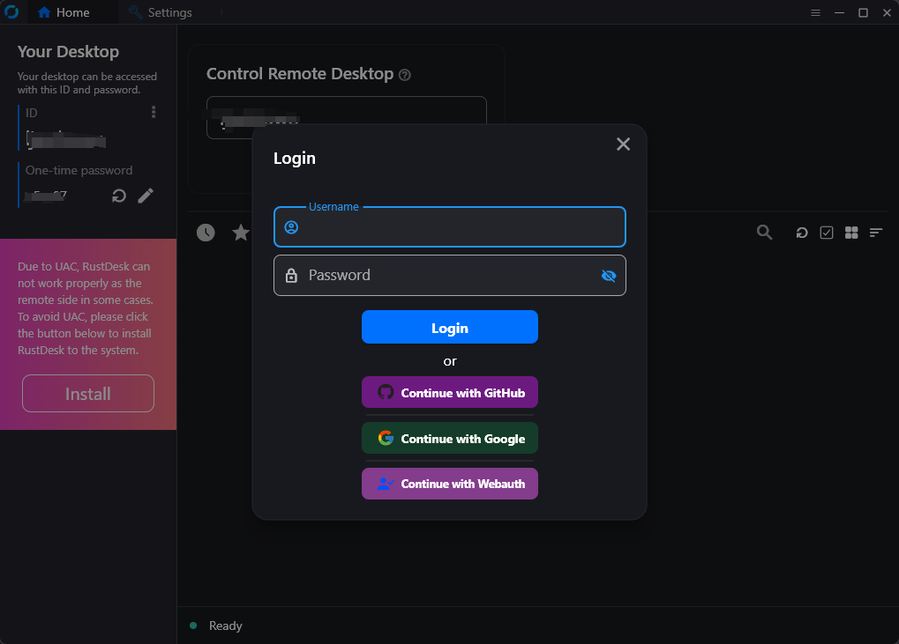
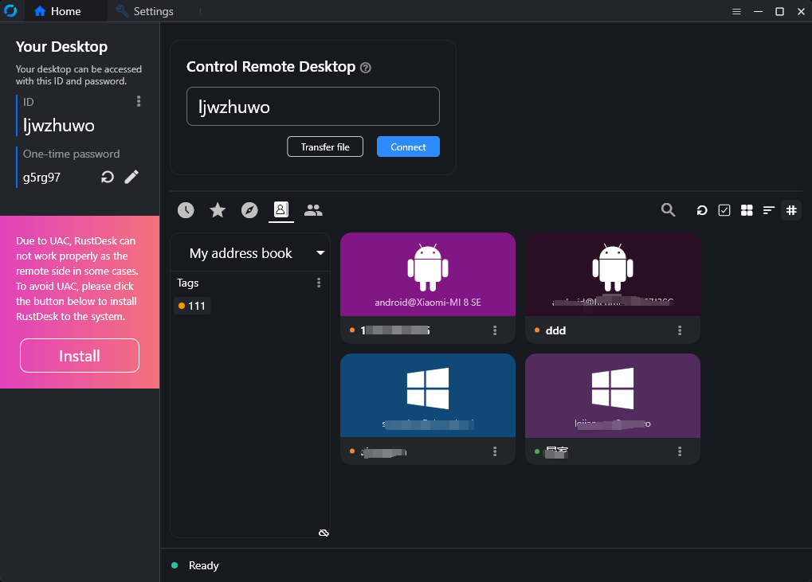
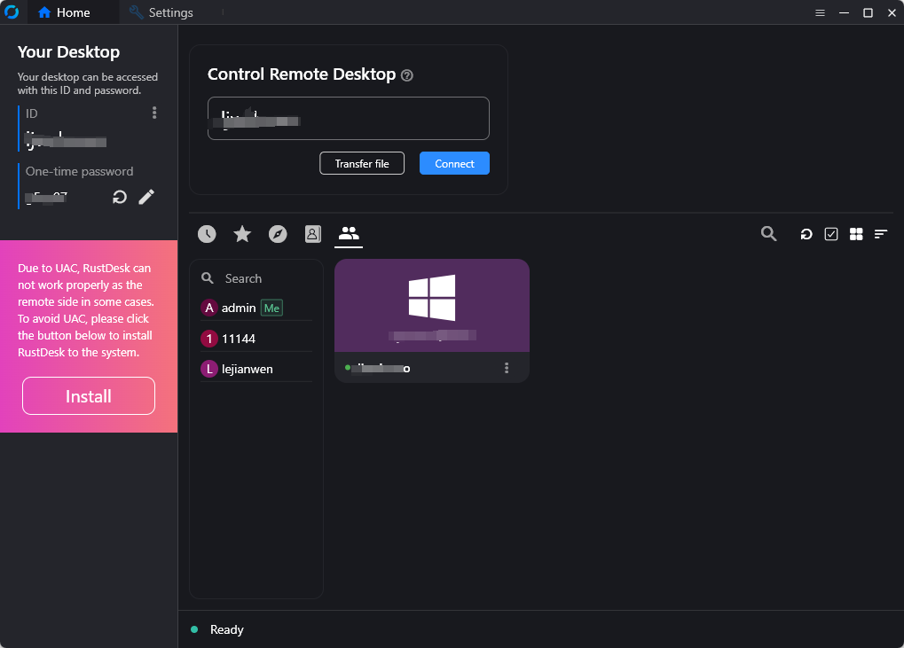
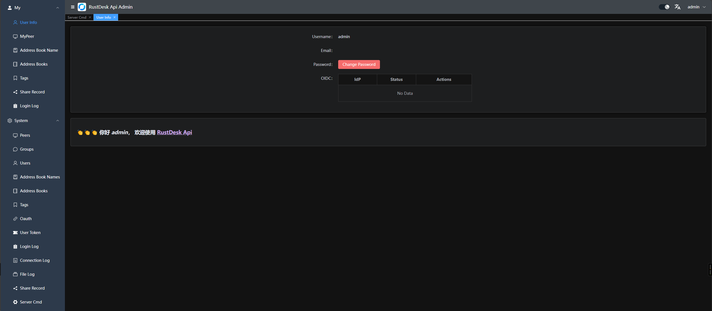
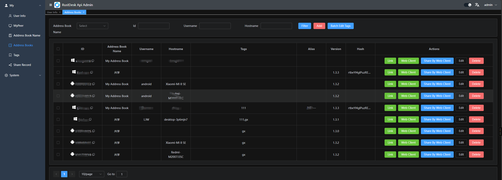
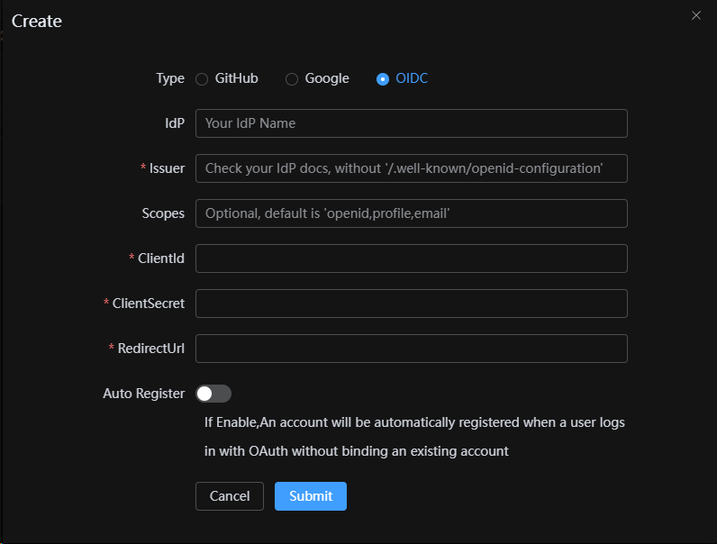

# RustDesk API

This project implements the RustDesk API using Go, and includes both a web UI and web client. RustDesk is a remote
desktop software that provides self-hosted solutions.

<div align=center>


</div>

# Features

- PC API
    - Personal API
    - Login
    - Address Book
    - Groups
    - Authorized login, supports `GitHub` and `Google` login, supports `web admin` authorized login
    - i18n
- Web Admin
    - User Management
    - Device Management
    - Address Book Management
    - Tag Management
    - Group Management
    - OAuth Management
    - Quick access to web client
    - i18n
    - Share to guest by web client
- Web Client
    - Automatically obtain API server
    - Automatically obtain ID server and KEY
    - Automatically obtain address book
    - Visitors are remotely to the device via a temporary sharing link

## Prerequisites

### [Rustdesk](https://github.com/rustdesk/rustdesk)


#### The PC client uses version ***1.3.0***, and versions ***1.2.6+*** have been tested to work.

#### Solutions for PC client connection timeout or connection issues
##### Connection issues or timeouts
Because the server version lags behind the client version, the server does not respond to the client's `secure_tcp` request, causing the client to timeout.
  Relevant code can be found at `https://github.com/rustdesk/rustdesk/blob/master/src/client.rs#L322`
  ```rust
    if !key.is_empty() && !token.is_empty() {
    // mainly for the security of token
    allow_err!(secure_tcp(&mut socket, key).await);
    }
  ```
  
As seen, when both `key` and `token` are not empty, `secure_tcp` is called, but the server does not respond, causing the client to timeout.
The `secure_tcp` code is located at `https://github.com/rustdesk/rustdesk/blob/master/src/common.rs#L1203`

##### Four Solutions
1. Specify the key on the server.
    - Advantage: Simple
    - Disadvantage: The connection is not encrypted
       ```bash
       hbbs -r <relay-server-ip[:port]> -k <key>
       hbbr -k <key>
       ```
      For example
       ```bash
         hbbs -r <relay-server-ip[:port]> -k abc1234567
         hbbr -k abc1234567
       ```
2. Use a system-generated key or a custom key pair on the server. If the client is already logged in, it may timeout or fail to connect. Logging out and reconnecting usually resolves the issue, and the web client does not need to log out.
    - Advantage: Encrypted connection
    - Disadvantage: Complicated operation
3. Use a system-generated key or a custom key pair on the server, fork the official client code to modify `secure_tcp` to return directly, then compile using `Github Actions` and download the compiled client.
   Refer to [official documentation](https://rustdesk.com/docs/en/dev/build/all/)
    - Advantage: Encrypted connection, customizable client features, ready to use after compilation
    - Disadvantage: Requires forking code and compiling, which can be challenging
4. Use [my forked code](https://github.com/lejianwen/rustdesk), which has already modified `secure_tcp`. You can download and use it directly from [here](https://github.com/lejianwen/rustdesk/releases)
    - Advantage: Code changes are viewable, compiled with `Github Actions`, encrypted connection, ready to use
    - Disadvantage: May not keep up with official version updates
   
***If encryption is not a high priority, use `1`. If encryption is important, use `3` or `4`.***

## Overview

### API Service
Basic implementation of the PC client's primary interfaces.Supports the Personal version api, which can be enabled by configuring the `rustdesk.personal` file or the `RUSTDESK_API_RUSTDESK_PERSONAL` environment variable.

#### Login

- Added `GitHub` and `Google` login, which can be used after configuration in the admin panel. See the OAuth
  configuration section for details.
- Added authorization login for the web admin panel.



#### Address Book



#### Groups
Groups are divided into `shared groups` and `regular groups`. In shared groups, everyone can see the peers of all group members, while in regular groups, only administrators can see all members' peers.



### Web Admin

* The frontend and backend are separated to provide a user-friendly management interface, primarily for managing and
displaying data.Frontend code is available at [rustdesk-api-web](https://github.com/lejianwen/rustdesk-api-web)

* Admin panel URL: `http://<your server[:port]>/_admin/`. The default username and password for the initial
installation are `admin` `admin`, please change the password immediately.

1. Admin interface:
   
2. Regular user interface:
   
   You can change your password from the top right corner:
   
3. Groups can be customized for easy management. Currently, two types are supported: `shared group` and `regular group`.
   
4. You can directly open the web client for convenient use; it can also be shared with guests, allowing them to remotely access the device via the web client.
   
5. OAuth support: Currently, `GitHub` and `Google`  is supported. You need to create an `OAuth App` and configure it in
   the admin
   panel.
   
    - Create a `GitHub OAuth App`
      at `Settings` -> `Developer settings` -> `OAuth Apps` -> `New OAuth App` [here](https://github.com/settings/developers).
    - Set the `Authorization callback URL` to `http://<your server[:port]>/api/oauth/callback`,
      e.g., `http://127.0.0.1:21114/api/oauth/callback`.

### Web Client:

1. If you're already logged into the admin panel, the web client will log in automatically.
2. If you're not logged in, simply click the login button at the top right corner, and the API server will be
   pre-configured.
   
3. After logging in, the ID server and key will be automatically synced.
4. The address book will also be automatically saved to the web client for convenient use.

### Automated Documentation : API documentation is generated using Swag, making it easier for developers to understand and use the API.

1. Admin panel docs: `<your server[:port]>/admin/swagger/index.html`
2. PC client docs: `<your server[:port]>/swagger/index.html`
   

## Installation and Setup

### Configuration

* Modify the configuration in `conf/config.yaml`. 
* If `gorm.type` is set to `sqlite`, MySQL-related configurations are not required.
* Language support: `en` and `zh-CN` are supported. The default is `zh-CN`.

```yaml
lang: "en"
app:
  web-client: 1  # web client route 1:open 0:close  
gin:
  api-addr: "0.0.0.0:21114"
  mode: "release"
  resources-path: 'resources'
  trust-proxy: ""
gorm:
  type: "sqlite"
  max-idle-conns: 10
  max-open-conns: 100
mysql:
  username: "root"
  password: "111111"
  addr: "192.168.1.66:3308"
  dbname: "rustdesk"
rustdesk:
  id-server: "192.168.1.66:21116"
  relay-server: "192.168.1.66:21117"
  api-server: "http://192.168.1.66:21114"
  key: "123456789"
  personal: 1
logger:
  path: "./runtime/log.txt"
  level: "warn" #trace,debug,info,warn,error,fatal
  report-caller: true
```

### Environment Variables
The prefix for variable names is `RUSTDESK_API`. If environment variables exist, they will override the configurations in the configuration file.

| Variable Name                      | Description                                               | Example                       |
|------------------------------------|-----------------------------------------------------------|-------------------------------|
| TZ                                 | timezone                                                  | Asia/Shanghai                 |
| RUSTDESK_API_LANG                  | Language                                                  | `en`,`zh-CN`                  |
| RUSTDESK_API_APP_WEB_CLIENT        | web client on/off; 1: on, 0 off, deault 1                 | 1                             |
| ----- GIN Configuration -----      | ---------------------------------------                   | ----------------------------- |
| RUSTDESK_API_GIN_TRUST_PROXY       | Trusted proxy IPs, separated by commas.                   | 192.168.1.2,192.168.1.3       |
| ----- GORM Configuration -----     | ---------------------------------------                   | ----------------------------- |
| RUSTDESK_API_GORM_TYPE             | Database type (`sqlite` or `mysql`). Default is `sqlite`. | sqlite                        |
| RUSTDESK_API_GORM_MAX_IDLE_CONNS   | Maximum idle connections                                  | 10                            |
| RUSTDESK_API_GORM_MAX_OPEN_CONNS   | Maximum open connections                                  | 100                           |
| RUSTDESK_API_RUSTDESK_PERSONAL     | Open Personal Api 1:Enable,0:Disable                      | 1                             |
| ----- MYSQL Configuration -----    | ---------------------------------------                   | ----------------------------- |
| RUSTDESK_API_MYSQL_USERNAME        | MySQL username                                            | root                          |
| RUSTDESK_API_MYSQL_PASSWORD        | MySQL password                                            | 111111                        |
| RUSTDESK_API_MYSQL_ADDR            | MySQL address                                             | 192.168.1.66:3306             |
| RUSTDESK_API_MYSQL_DBNAME          | MySQL database name                                       | rustdesk                      |
| ----- RUSTDESK Configuration ----- | ---------------------------------------                   | ----------------------------- |
| RUSTDESK_API_RUSTDESK_ID_SERVER    | Rustdesk ID server address                                | 192.168.1.66:21116            |
| RUSTDESK_API_RUSTDESK_RELAY_SERVER | Rustdesk relay server address                             | 192.168.1.66:21117            |
| RUSTDESK_API_RUSTDESK_API_SERVER   | Rustdesk API server address                               | http://192.168.1.66:21114     |
| RUSTDESK_API_RUSTDESK_KEY          | Rustdesk key                                              | 123456789                     |
| ---- PROXY -----                   | ---------------                                           | ----------                    |
| RUSTDESK_API_PROXY_ENABLE          | proxy_enable :`false`, `true`                             | `false`                       |
| RUSTDESK_API_PROXY_HOST            | proxy_host                                                | `http://127.0.0.1:1080`       |

### Installation Steps

#### Running via Docker

1. Run directly with Docker. Configuration can be modified by mounting the config file `/app/conf/config.yaml`, or by
   using environment variables to override settings.
    
    ```bash
    docker run -d --name rustdesk-api -p 21114:21114 \
    -v /data/rustdesk/api:/app/data \
    -e RUSTDESK_API_LANG=en \
    -e RUSTDESK_API_RUSTDESK_ID_SERVER=192.168.1.66:21116 \
    -e RUSTDESK_API_RUSTDESK_RELAY_SERVER=192.168.1.66:21117 \
    -e RUSTDESK_API_RUSTDESK_API_SERVER=http://192.168.1.66:21114 \
    -e RUSTDESK_API_RUSTDESK_KEY=abc123456 \
    lejianwen/rustdesk-api
    ```

2. Using `docker-compose`
    - Simple example:
       ```yaml
       services:
          rustdesk-api:
           container_name: rustdesk-api
           environment:
             - RUSTDESK_API_LANG=en
             - RUSTDESK_API_RUSTDESK_ID_SERVER=192.168.1.66:21116
             - RUSTDESK_API_RUSTDESK_RELAY_SERVER=192.168.1.66:21117
             - RUSTDESK_API_RUSTDESK_API_SERVER=http://192.168.1.66:21114
             - RUSTDESK_API_RUSTDESK_KEY=<key>
           ports:
             - 21114:21114
           image: lejianwen/rustdesk-api
           volumes:
             - /data/rustdesk/api:/app/data # Mount the database for easy backup
           networks:
             - rustdesk-net
           restart: unless-stopped
       ```

    - Example with RustDesk's official Docker Compose file, adding your `rustdesk-api` service:
     - If you are using a system-generated KEY, remove the `-k <key>` parameter. However, after the first startup, run `docker-compose logs hbbs` or `cat ./data/id_ed25519.pub` to view the KEY, then modify `RUSTDESK_API_RUSTDESK_KEY=<key>` and execute `docker-compose up -d` again.
       ```yaml
          networks:
            rustdesk-net:
              external: false
          services:
            hbbs:
              container_name: hbbs
              ports:
                - 21115:21115
                - 21116:21116 # 自定义 hbbs 映射端口
                - 21116:21116/udp # 自定义 hbbs 映射端口
                - 21118:21118 # web client
              image: rustdesk/rustdesk-server
              command: hbbs -r <relay-server-ip[:port]> -k <key> # 填入个人域名或 IP + hbbr 暴露端口
              volumes:
                - ./data:/root # 自定义挂载目录
              networks:
                - rustdesk-net
              depends_on:
                - hbbr
              restart: unless-stopped
              deploy:
                resources:
                  limits:
                    memory: 64M
            hbbr:
              container_name: hbbr
              ports:
                - 21117:21117 # 自定义 hbbr 映射端口
                - 21119:21119 # web client
              image: rustdesk/rustdesk-server
              command: hbbr -k <key>
              volumes:
                - ./data:/root
              networks:
                - rustdesk-net
              restart: unless-stopped
              deploy:
                resources:
                  limits:
                    memory: 64M
            rustdesk-api:
              container_name: rustdesk-api
              environment:
                - TZ=Asia/Shanghai
                - RUSTDESK_API_RUSTDESK_ID_SERVER=192.168.1.66:21116
                - RUSTDESK_API_RUSTDESK_RELAY_SERVER=192.168.1.66:21117
                - RUSTDESK_API_RUSTDESK_API_SERVER=http://192.168.1.66:21114
                - RUSTDESK_API_RUSTDESK_KEY=<key>
              ports:
                - 21114:21114
              image: lejianwen/rustdesk-api
              volumes:
                - /data/rustdesk/api:/app/data #将数据库挂载出来方便备份
              networks:
                - rustdesk-net
              restart: unless-stopped
          ```

   - S6 image
       - - If using ***custom KEY***, you will need to modify the startup script to override the `/etc/s6-overlay/s6-rc.d/hbbr/run` and `/etc/s6-overlay/s6-rc.d/hbbr/run` in the image.
           1. Create `hbbr/run`, only needed for custom KEY
              ```bash
              #!/command/with-contenv sh
              cd /data
              PARAMS=
              [ "${ENCRYPTED_ONLY}" = "1" ] && PARAMS="-k ${KEY}"
              /usr/bin/hbbr $PARAMS
              ```
           2. Create `hbbs/run`, only needed for custom KEY
               ```bash
               #!/command/with-contenv sh
               sleep 2
               cd /data
               PARAMS=
               [ "${ENCRYPTED_ONLY}" = "1" ] && PARAMS="-k ${KEY}"
               /usr/bin/hbbs -r $RELAY $PARAMS
               ```
           3. Modify the `s6` section in `docker-compose.yml`
           ```yaml
           networks:
             rustdesk-net:
               external: false
           services:
             rustdesk-server:
               container_name: rustdesk-server
               ports:
                 - 21115:21115
                 - 21116:21116
                 - 21116:21116/udp
                 - 21117:21117
                 - 21118:21118
                 - 21119:21119
               image: rustdesk/rustdesk-server-s6:latest
               environment:
                 - RELAY=192.168.1.66:21117
                 - ENCRYPTED_ONLY=1
                 - KEY=<key>  #KEY
               volumes:
                 - ./data:/data
                 - ./hbbr/run:/etc/s6-overlay/s6-rc.d/hbbr/run 
                 - ./hbbs/run:/etc/s6-overlay/s6-rc.d/hbbs/run 
               restart: unless-stopped
             rustdesk-api:
               container_name: rustdesk-api
               ports:
                 - 21114:21114
               image: lejianwen/rustdesk-api
               environment:
                 - TZ=Asia/Shanghai
                 - RUSTDESK_API_RUSTDESK_ID_SERVER=192.168.1.66:21116
                 - RUSTDESK_API_RUSTDESK_RELAY_SERVER=192.168.1.66:21117
                 - RUSTDESK_API_RUSTDESK_API_SERVER=http://192.168.1.66:21114
                 - RUSTDESK_API_RUSTDESK_KEY=<key>
               volumes:
                 - /data/rustdesk/api:/app/data 
               networks:
                 - rustdesk-net
               restart: unless-stopped
           ```
   - If using ***system-generated KEY*** or ***custom KEY_PUB, KEY_PRIV***, you do not need to modify the startup script, but you need to obtain the KEY after it is generated and then run `docker-compose up -d`
       ```yaml
       networks:
         rustdesk-net:
           external: false
       services:
         rustdesk-server:
           container_name: rustdesk-server
           ports:
             - 21115:21115
             - 21116:21116
             - 21116:21116/udp
             - 21117:21117
             - 21118:21118
             - 21119:21119
           image: rustdesk/rustdesk-server-s6:latest
           environment:
             - RELAY=192.168.1.66:21117
             - ENCRYPTED_ONLY=1
           volumes:
             - ./data:/data
           restart: unless-stopped
         rustdesk-api:
           container_name: rustdesk-api
           ports:
             - 21114:21114
           image: lejianwen/rustdesk-api
           environment:
             - TZ=Asia/Shanghai
             - RUSTDESK_API_RUSTDESK_ID_SERVER=192.168.1.66:21116
             - RUSTDESK_API_RUSTDESK_RELAY_SERVER=192.168.1.66:21117
             - RUSTDESK_API_RUSTDESK_API_SERVER=http://192.168.1.66:21114
             - RUSTDESK_API_RUSTDESK_KEY=<key>
           volumes:
             - /data/rustdesk/api:/app/data 
           networks:
             - rustdesk-net
           restart: unless-stopped
       ```

#### Running from Release

Download the release from [release](https://github.com/lejianwen/rustdesk-api/releases).

#### Source Installation

1. Clone the repository:
   ```bash
   git clone https://github.com/lejianwen/rustdesk-api.git
   cd rustdesk-api
   ```

2. Install dependencies:

    ```bash
    go mod tidy
    # Install Swag if you need to generate documentation; otherwise, you can skip this step
    go install github.com/swaggo/swag/cmd/swag@latest
    ```

3. Build the admin front-end (the front-end code is
   in [rustdesk-api-web](https://github.com/lejianwen/rustdesk-api-web)):
   ```bash
   cd resources
   mkdir -p admin
   git clone https://github.com/lejianwen/rustdesk-api-web
   cd rustdesk-api-web
   npm install
   npm run build
   cp -ar dist/* ../admin/
   ```

4. Run:
    ```bash
    # Run directly
    go run cmd/apimain.go
    # Or generate and run the API using generate_api.go
    go generate generate_api.go
    ```

5. To compile, change to the project root directory. For Windows, run `build.bat`, and for Linux, run `build.sh`. After
   compiling, the corresponding executables will be generated in the `release` directory. Run the compiled executables
   directly.

6. Open your browser and visit `http://<your server[:port]>/_admin/`, with default credentials `admin admin`. Please
   change the password promptly.

#### nginx reverse proxy
Configure reverse proxy in `nginx`
```
server {
    listen <your port>;
    server_name <your server>;
    location / {
        proxy_pass http://<api-server[:port]>;
        proxy_set_header Host $host;
        proxy_set_header X-Real-IP $remote_addr;
        proxy_set_header X-Forwarded-For $proxy_add_x_forwarded_for;
        proxy_set_header X-Forwarded-Proto $scheme;
    }
}
```
## Others

- [Change client ID](https://github.com/abdullah-erturk/RustDesk-ID-Changer)
- [Web client source](https://hub.docker.com/r/keyurbhole/flutter_web_desk)